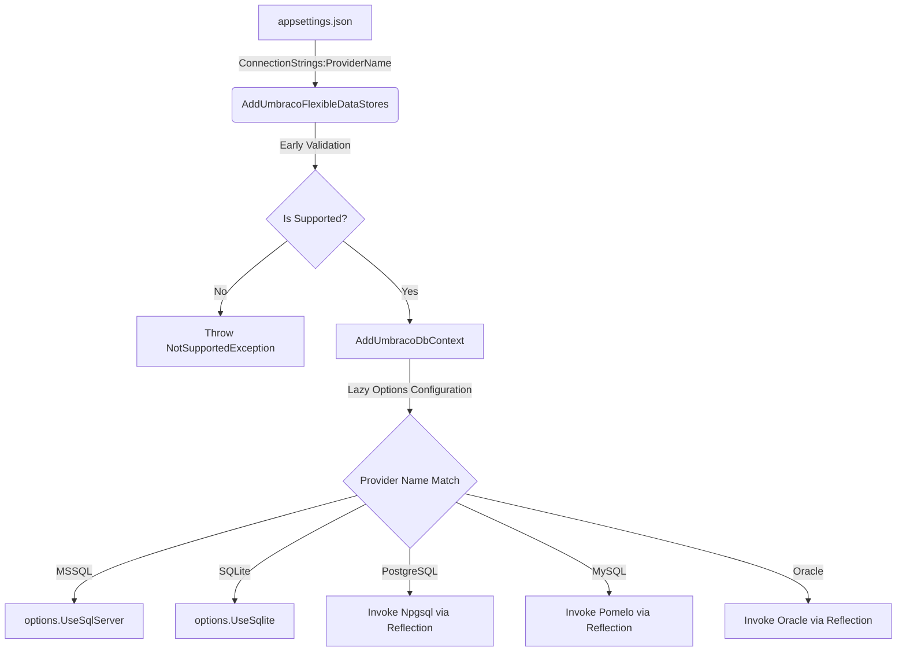

# Umbraco Omni - Database-Agnostic EF Core Migration Architecture

This document tracks the core architectural decisions, design guidelines, and implementation strategies for migrating the database layer of Umbraco Omni from NPoco (micro-ORM, SQL Server-centric) to a database-agnostic **Entity Framework Core** architecture.

---

## Technical Goal
The goal of this migration is to enable out-of-the-box support for **five major Relational Database Management Systems (RDBMS)** from a single, unified codebase:
1. **Microsoft SQL Server (MSSQL)**
2. **PostgreSQL**
3. **MySQL (Pomelo)**
4. **Oracle**
5. **SQLite**

---

## Architectural Decision Records (ADR)

### ADR 001: Selection of Entity Framework Core (EF Core)

#### Context
Umbraco CMS historically relies on NPoco, a lightweight micro-ORM. While performant, NPoco lacks robust database-agnostic abstractions and leads to the proliferation of raw, SQL Server-specific SQL queries directly embedded in repository implementations. This makes supporting multiple database providers (specifically PostgreSQL, MySQL, and Oracle) highly error-prone and difficult to maintain.

#### Decision
We will completely migrate the persistence layer to **Entity Framework Core (EF Core)**. EF Core provides:
- First-class database provider abstractions.
- A strongly typed LINQ querying model that is translated into provider-specific SQL dynamically.
- Out-of-the-box support for database migrations across multiple providers.
- Robust transaction coordination and Unit of Work patterns natively supported by `DbContext`.

#### Consequences
- All custom repositories will be rewritten or adapted to use EF Core repositories.
- Database DTOs will be mapped to EF Core entities.
- Raw SQL Server-specific constructs will be replaced with database-agnostic LINQ statements or provider-specific strategy setups.

---

### ADR 002: Flexible Database Selection Layer (Dependency Injection)

#### Context
To allow the host application to run on any of the five supported databases, the configuration must dynamically determine the active database provider at startup, register the `UmbracoDbContext` accordingly, and configure options such as connection strings and OpenIddict integration.

#### Decision
We introduced a dynamic database configuration layer via the extension method [AddUmbracoFlexibleDataStores()](file:///Users/tunc/Source/Umbraco%20Hydra/Umbraco.Omni/src/Umbraco.Cms.Persistence.EFCore/Extensions/UmbracoFlexibleDataStoresExtensions.cs):
- Reads the configuration section `ConnectionStrings` to extract the `ProviderName` and `ConnectionString` (specifically checking for `umbracoDbDSN` and `umbracoDbDSN_ProviderName`).
- Performs early validation of the provider name on application startup, throwing a descriptive `NotSupportedException` if the provider name is unknown or unsupported.
- Integrates with Umbraco's scoping infrastructure by registering the DbContext using the existing `AddUmbracoDbContext` helper.
- Uses **Reflection-based dynamic assembly loading** to configure PostgreSQL (`Npgsql`), MySQL (`Pomelo`), and Oracle (`Oracle.EntityFrameworkCore`) database providers. This keeps the core persistence assembly lightweight and avoids hard-linking external database drivers, while allowing the startup project to pull in the appropriate driver via standard package references.



#### Code Implementation
The dynamic selection layer is defined in:
- **Implementation File:** [UmbracoFlexibleDataStoresExtensions.cs](file:///Users/tunc/Source/Umbraco%20Hydra/Umbraco.Omni/src/Umbraco.Cms.Persistence.EFCore/Extensions/UmbracoFlexibleDataStoresExtensions.cs)
- **Composer Registration:** [UmbracoEFCoreComposer.cs](file:///Users/tunc/Source/Umbraco%20Hydra/Umbraco.Omni/src/Umbraco.Cms.Persistence.EFCore/Composition/UmbracoEFCoreComposer.cs)

#### Supported Provider Names (Case-Insensitive)
| Target Database | Allowed Configuration Values | Assembly Name |
| :--- | :--- | :--- |
| **SQL Server** | `MSSQL`, `SQLServer`, `Microsoft.Data.SqlClient`, `System.Data.SqlClient` | `Microsoft.EntityFrameworkCore.SqlServer` |
| **SQLite** | `SQLite`, `Sqlite`, `Microsoft.Data.Sqlite`, `Microsoft.Data.SQLite` | `Microsoft.EntityFrameworkCore.Sqlite` |
| **PostgreSQL** | `PostgreSQL`, `Npgsql`, `Npgsql.EntityFrameworkCore.PostgreSQL` | `Npgsql.EntityFrameworkCore.PostgreSQL` |
| **MySQL** | `MySQL`, `MySql`, `Pomelo`, `Pomelo.EntityFrameworkCore.MySql` | `Pomelo.EntityFrameworkCore.MySql` |
| **Oracle** | `Oracle`, `Oracle.EntityFrameworkCore` | `Oracle.EntityFrameworkCore` |

### ADR 003: Dynamic Model Customization and Provider-Specific Configuration

#### Context
Each target RDBMS has specific schema requirements, casing conventions, identifier character limits, and index behaviors:
- **PostgreSQL** uses lowercase, case-sensitive identifiers by default. When mixed-case identifiers (common in SQL Server-centric schemas) are used, PostgreSQL requires double-quoting them in every query, causing syntax and query translation errors unless tables, columns, constraints, and index names are mapped to lowercase or snake_case.
- **Oracle** enforces strict character limits for database object names (historically 30 characters; 128 characters starting with Oracle 12c). Lengthy indexes and foreign keys configured for SQL Server easily exceed this, causing DDL execution failures (e.g., `ORA-00972: identifier is too long`).
- **MySQL** restricts identifier names (including foreign keys and indexes) to a maximum of 64 characters.

#### Decision
We will dynamically customize and rewrite metadata mappings inside [UmbracoDbContext.OnModelCreating(ModelBuilder)](file:///Users/tunc/Source/Umbraco%20Hydra/Umbraco.Omni/src/Umbraco.Cms.Persistence.EFCore/UmbracoDbContext.cs) at runtime, based on the active provider (`Database.ProviderName`):
- **PostgreSQL (`Npgsql.EntityFrameworkCore.PostgreSQL`):** Automatically convert all table names (after applying the `umbraco` schema prefix), column names, primary/unique key names, foreign key constraint names, and index names to `snake_case`. This eliminates all casing and identifier quoting issues in PostgreSQL.
- **Oracle (`Oracle.EntityFrameworkCore`):** Enforce a conservative 30-character limit for keys, foreign keys, and index names to maximize compatibility with legacy Oracle installations. The truncation uses a deterministic 8-character hash suffix (e.g., `[pre-truncated-string]_[deterministic-hash]`) to guarantee uniqueness and prevent identifier collisions.
- **MySQL (`Pomelo.EntityFrameworkCore.MySql`):** Enforce a 64-character identifier limit for indexes and foreign key constraints using the same hash-based truncation strategy.

#### Consequences
- Migrations generated for PostgreSQL will contain pure lowercase, snake_case tables and columns (e.g., `umbraco_user2_user_group`).
- Oracle schemas will not trigger long identifier exceptions during execution of generated migrations.
- Index and constraint names will be normalized across all RDBMS providers.

### ADR 004: Enterprise Repository and Unit of Work Design (EF Core)

#### Context
Moving from NPoco to EF Core requires a standardized way to perform CRUD operations and coordinate transactions across multiple entities. We need to decouple our business and command/query (CQRS) layers from EF Core's concrete `DbContext` implementations, ensuring database-agnostic repository operations while facilitating transaction boundaries.

#### Decision
We introduced clean Generic Repository and Unit of Work abstractions:
- **`IEfRepository<TEntity>` & `EfRepository<TEntity>`:** Implemented standard asynchronous operations (`GetByIdAsync`, `GetAllAsync`, `AddAsync`, `AddRangeAsync`, `Update`, `Delete`, `DeleteRange`, `AnyAsync`, `CountAsync`) along with a dynamic `Query(asNoTracking)` method. The `Query` method returns an `IQueryable<TEntity>` which allows developers to build deferred, database-agnostic LINQ projections and query specifications without exposing raw database connection logic.
- **`IEfUnitOfWork` & `EfUnitOfWork`:** Manages a thread-safe `ConcurrentDictionary` to cache repository instances during the lifetime of a request, preventing duplicate instances. It implements transaction management (`BeginTransactionAsync`, `CommitTransactionAsync`, `RollbackTransactionAsync`) leveraging EF Core's `IDbContextTransaction` with robust, provider-compatible exception catching and automatic rollbacks.
- **Lifetime Management:** Both abstractions are registered as `Scoped` dependencies in the IoC container via [AddUmbracoFlexibleDataStores()](file:///Users/tunc/Source/Umbraco%20Hydra/Umbraco.Omni/src/Umbraco.Cms.Persistence.EFCore/Extensions/UmbracoFlexibleDataStoresExtensions.cs) to ensure that a single request maintains a unified transaction context across multiple database operations.

#### Consequences
- Business handlers interact with database-agnostic interfaces (`IEfRepository<T>` and `IEfUnitOfWork`), improving unit testability via mocking.
- DB Transactions are uniformly safe, and resources are cleanly disposed of via `IAsyncDisposable` and `IDisposable` interfaces implemented by the Unit of Work.
- Shared transaction contexts allow consistent behavior across MSSQL, PostgreSQL, MySQL, Oracle, and SQLite.

### ADR 005: Raw Query Elimination and EF Core Performance Optimization

#### Context
NPoco relies heavily on string-based SQL queries, which are hard to validate at compile-time and often use SQL Server-specific syntax (e.g., `TOP N`, bracket escaping, system tables). Furthermore, micro-ORMs avoid tracking overhead but don't provide complex relationship loading efficiently. When migrating to EF Core, if we are not careful with relationship loading (triggering N+1 query problems) or tracking overhead, database performance can degrade compared to raw NPoco.

#### Decision
We will systematically rewrite NPoco raw queries to strongly typed LINQ queries, and apply three core EF Core performance optimization techniques for high-throughput and heavy query workloads (such as hierarchy loading and user group permissions):
- **`AsNoTracking()`:** Unconditionally applied to all read-only query operations to bypass the EF Core change tracker, reducing memory allocation to zero for reads.
- **`AsSplitQuery()` (Query Splitting):** Applied to queries containing multiple `Include` statements or heavy JOINs (e.g., fetching document properties and versions). This avoids Cartesian explosion issues by executing separate queries for collection inclusions, significantly optimizing execution plans.
- **`EF.CompileAsyncQuery` (Compiled Queries):** Used for highly repetitive, parameterized query templates (like fetching content nodes by ID or hierarchy). This compiles the query expression tree once and caches it, matching or exceeding NPoco raw query execution times.

#### Consequences
- SQL queries are compiled and validated at build-time, preventing runtime database syntax exceptions on different providers.
- Memory consumption during heavy content reads is minimized.
- Cartesian product explosions on collections are avoided, reducing database server CPU usage.

---

## NPoco Repository to EF Core Migration Guide

This guide provides a standardized pattern for refactoring existing NPoco repositories (inheriting from `RepositoryBase`) to the new [IEfRepository&lt;T&gt;](file:///Users/tunc/Source/Umbraco%20Hydra/Umbraco.Omni/src/Umbraco.Cms.Persistence.EFCore/Repositories/IEfRepository.cs) and [IEfUnitOfWork](file:///Users/tunc/Source/Umbraco%20Hydra/Umbraco.Omni/src/Umbraco.Cms.Persistence.EFCore/UnitOfWork/IEfUnitOfWork.cs) architecture.

### 1. NPoco Legacy Pattern (Before)
Legacy repositories directly execute raw strings or NPoco fluent syntax against `AmbientScope.Database`:
```csharp
public class UserRepository : RepositoryBase, IUserRepository
{
    public UserRepository(IScopeAccessor scopeAccessor, AppCaches appCaches)
        : base(scopeAccessor, appCaches) { }

    public UserDto? GetUserWithGroups(int id)
    {
        var sql = Sql()
            .Select("*")
            .From<UserDto>()
            .Where<UserDto>(x => x.Id == id);
            
        var user = Database.FirstOrDefault<UserDto>(sql);
        if (user != null)
        {
            user.UserGroupDtos = Database.Fetch<UserGroupDto>(
                "SELECT * FROM umbracoUserGroup INNER JOIN umbracoUser2UserGroup ON ...");
        }
        return user;
    }
}
```

### 2. EF Core Modern Pattern (After)
Modern repositories inject `IEfUnitOfWork` (or a specific `IEfRepository<T>`) to query data using LINQ and defer transaction control to the Unit of Work:
```csharp
public class UserRepository : IUserRepository
{
    private readonly IEfUnitOfWork _unitOfWork;

    public UserRepository(IEfUnitOfWork unitOfWork)
    {
        _unitOfWork = unitOfWork;
    }

    public async Task<UserDto?> GetUserWithGroupsAsync(int id, CancellationToken cancellationToken = default)
    {
        // Leverage the repository interface resolved from Unit of Work
        var repository = _unitOfWork.Repository<UserDto>();

        return await repository.Query(asNoTracking: true)
            .AsSplitQuery() // Prevent Cartesian product issues across relationships
            .Include(u => u.UserGroupDtos)
            .FirstOrDefaultAsync(u => u.Id == id, cancellationToken);
    }
}
```

---

### ADR 006: Multi-Database Provider Migrations Management Strategy

#### Context
EF Core migrations generated for SQL Server are not directly compatible with PostgreSQL, SQLite, MySQL, or Oracle due to differences in syntax, schema object names, casing conventions, column types, and database capabilities. Storing migrations for all providers in a single project leads to name collisions, mixed provider dependency coupling, and execution failures.

#### Decision
We will segregate migrations for each RDBMS into its own dedicated migration assembly (project):
- **SQL Server:** `Umbraco.Cms.Persistence.EFCore.SqlServer`
- **SQLite:** `Umbraco.Cms.Persistence.EFCore.Sqlite`
- **PostgreSQL:** `Umbraco.Cms.Persistence.EFCore.PostgreSQL`
- **MySQL:** `Umbraco.Cms.Persistence.EFCore.MySQL`
- **Oracle:** `Umbraco.Cms.Persistence.EFCore.Oracle`

Inside [AddUmbracoFlexibleDataStores()](file:///Users/tunc/Source/Umbraco%20Hydra/Umbraco.Omni/src/Umbraco.Cms.Persistence.EFCore/Extensions/UmbracoFlexibleDataStoresExtensions.cs), when configuring the active provider options, we programmatically set the active provider's migration assembly via `.MigrationsAssembly("Umbraco.Cms.Persistence.EFCore.[ProviderName]")`. This instructs EF Core to read and apply migrations exclusively from that specific assembly project.

#### Consequences
- Schema changes and DDL commands are safely encapsulated per provider.
- Teams can add support for new databases simply by creating a new migrations assembly project and mapping it in the DI layer.
- Prevents database provider packages from bleeding into unrelated projects.

---

## Multi-Provider Migrations CLI Command Guide

To generate initial or incremental migration files for PostgreSQL, MySQL, and Oracle targeting their respective projects, use the following `dotnet ef` commands from your terminal.

> [!IMPORTANT]
> - Ensure your startup project (`--startup-project` / `-s`) is `src/Umbraco.Web.UI` (or the main entry web project).
> - Set the correct connection string and `ProviderName` in the startup project's `appsettings.json` (or configure via environment variables) before running the migrations command, so that EF Core's design-time services can resolve the target provider.

### 1. PostgreSQL Migrations
To generate migrations for PostgreSQL targeting the PostgreSQL migrations assembly:
```bash
dotnet ef migrations add InitialCreate \
  --project src/Umbraco.Cms.Persistence.EFCore.PostgreSQL \
  --startup-project src/Umbraco.Web.UI \
  --context UmbracoDbContext
```

### 2. MySQL Migrations
To generate migrations for MySQL targeting the MySQL migrations assembly:
```bash
dotnet ef migrations add InitialCreate \
  --project src/Umbraco.Cms.Persistence.EFCore.MySQL \
  --startup-project src/Umbraco.Web.UI \
  --context UmbracoDbContext
```

### 3. Oracle Migrations
To generate migrations for Oracle targeting the Oracle migrations assembly:
```bash
dotnet ef migrations add InitialCreate \
  --project src/Umbraco.Cms.Persistence.EFCore.Oracle \
  --startup-project src/Umbraco.Web.UI \
  --context UmbracoDbContext
```

### 4. Updating the Databases
To apply the generated migrations directly to the active configured database:
```bash
dotnet ef database update \
  --startup-project src/Umbraco.Web.UI \
  --context UmbracoDbContext
```

---

## Design and Coding Guidelines

1. **Keep Code Agnostic:** Do not write SQL Server-specific constructs in EF Core repositories. Use LINQ wherever possible.
2. **Provider Checks:** Avoid `IsSqlServer()` or `IsSqlite()` checks. If a query requires database-specific behavior, abstract it using specialized services or EF Core interceptors/custom SQL generators.
3. **Lazy Configuration:** Ensure that database provider options are resolved lazily from the DI container's options monitor, allowing hot-swapping or run-time connection string changes.
4. **Transaction Integrity:** Always coordinate modifications involving multiple tables using `IEfUnitOfWork` to ensure changes are committed atomically.
5. **No-Tracking by Default:** Utilize `Query(asNoTracking: true)` for read-only retrieval of data to optimize EF Core change-tracker performance.
6. **Query Splitting for Collections:** Apply `.AsSplitQuery()` whenever mapping multiple `.Include()` collections to mitigate Cartesian join issues.
7. **Compiled Queries for Lookups:** Use `EF.CompileAsyncQuery` to compile and cache highly repetitive, key-based SELECT queries to match or exceed micro-ORM performance.
8. **Migrations Segregation:** Always generate and manage migrations separately for each database provider using their respective migrations assembly.
